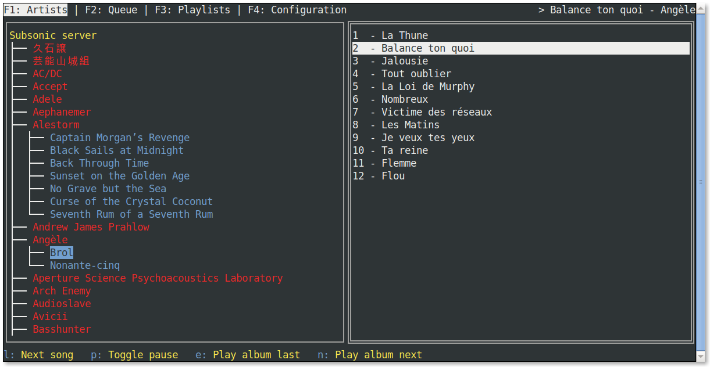

# termsonic - a TUI Subsonic client [(latest release)](https://git.sixfoisneuf.fr/releases/termsonic/latest/)

This project implements a terminal-based client for any [Subsonic](https://www.subsonic.org)-compatible server.

It currently supports the following:

- Browsing of Subsonic library organised by Artists and Albums
- Playback of OGG, FLAC and MP3 files
- Playlist support
- Play queue management



## Building

This application requires [Go](https://go.dev) version 1.19 at minimum.

```
$ git clone https://git.sixfoisneuf.fr/termsonic && cd termsonic
$ go build -o termsonic ./cmd
```

### Linux notes
Please note that Linux builds additionally need a working C compiler in their PATH. This is due to [faiface/beep](https://github.com/faiface/beep), used for audio playback.

You will also need the ALSA development libraries for your system. On Debian, this is `libasound2-dev`.

## Configuration

The application reads its configuration from `$XDG_CONFIG_DIR/termsonic.toml`, or `~/.config/termsonic.toml` if `XDG_CONFIG_DIR` doesn't exist.

On Windows, it reads its configuration from `%APPDATA%\\Termsonic\\termsonic.toml`.

You can edit the configuration from inside the app, or by hand using a text editor. See [the example configuration file](config.toml.example), and [the TOML reference](https://toml.io/en/). It is possible to specify another configuration file with the `-config` command-line argument.
